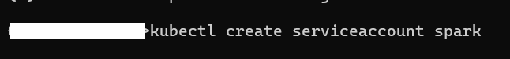

# Spark ETL

## Integrate Azure Storage Container Gen2 with Azure Kubernetes Services.

    - Load the hotels and weather data frames from the Azure storage container.
    - Check the hotels data for incorrect (null) values in the Latitude and Longitude columns. For incorrect values, map the Latitude and Longitude from the OpenCage Geocoding API on the fly (via REST API).
    - Generate a geohash using Latitude and Longitude with one of the geohash libraries (like geohash-java) with a length of 4 characters in an extra column.
    - Perform a left join of the weather and hotels data using the generated 4-character geohash (avoid data multiplication and make your job idempotent).
    - Deploy the Spark job on the Kubernetes Service.

### Pre-requisites

    - Azure Subscription
    - Azure CLI
    - Install Docker
    - Install kubectl
    - Install Terraform
    - Install Hadoop and Spark
    - Install Python3
    - Install Java (preferably version 8 or 11).

### Deploy infrastructure with terraform

    Go to the folder where the Terraform file is located and type the following commands. All commands and their results are shown in the following screenshots.

    1. To initializes a Terraform working directory.
    
    2. To create an execution plan, showing what actions Terraform will take to achieve the desired state described in the configuration files.
    
    
    3. To apply the changes required to reach the desired state of the configuration.
    
    

### Development and Testing

    You can perform development and testing either in a local environment or within a Docker container. In my case, I use a Docker container for these tasks. To set this up, you need to copy both your main Python files and your test files into the Docker container by specifying them in the Dockerfile. The code is organized in the src/main/ and src/tests/ directories in this repository.Below, I will show the Dockerfile creation and test results as screenshots.

    1. To create Docker image from a Dockerfile and a specified context.
    
    2. To list all the Docker images.
    
    3. To run a container from a specified Docker image.
    
    4. After a successful docker run command, it will start a Docker container command prompt.
    
    5. We can run tests using Docker containers. Below are the commands to run tests with pytest, along with screenshots. The main and test code can be found in the src/main/python and src/test folders, respectively.
    
    6. Test result
    

### Push Docker image to Azure Container Registry

    1. Log into  Azure Container Registry.
    2. Create Docker image to upload.
    
    3. Push created docker image to Azure Container Registry.
    

### Deploy Spark job on Kubernetes Service

    1. Login to your Azure account using azure CLI
    2. Integrate Azure Kubernetes Service with Azure Container Registry.
    3. Service account creation and assigning required cluster role.
    
    
    4. Run a Spark job within the bin directory in Spark Home on AKS.
    
    5. Follow screenshot shows details about running pods.
    
    6. After succefull job submision you will get following messages.
    
    7. Check pod after job submit.
    
